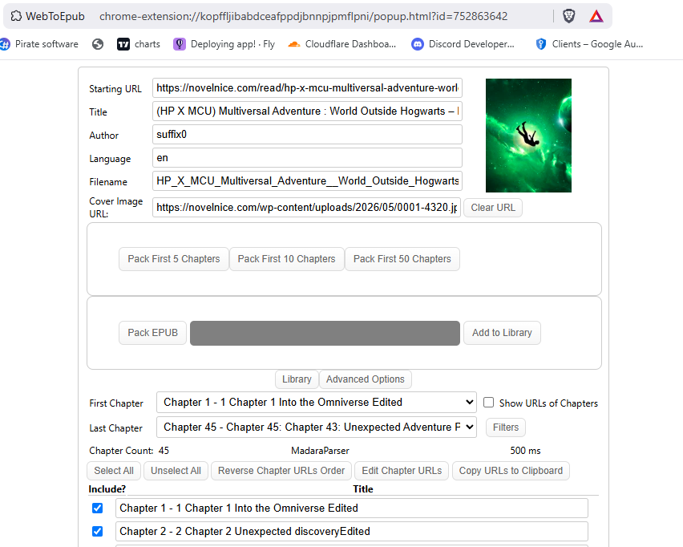

# WebToEpub (Fork)

A browser extension for Firefox and Chrome that converts web novels and other web pages into EPUB format for offline reading.

Based on the original project by [David Teviotdale](https://github.com/dteviot/WebToEpub).

---

## New Features in This Fork

This fork adds 3 new buttons for quickly packing a set number of chapters without manually selecting them:

- **Pack First 5 Chapters** – Packs only the first 5 chapters into an EPUB.
- **Pack First 10 Chapters** – Packs only the first 10 chapters into an EPUB.
- **Pack First 50 Chapters** – Packs only the first 50 chapters into an EPUB.

